# 🎓 JoinUs – 대학 동아리 신청 / 모집 플랫폼 (Frontend)

> 여러 곳에 흩어진 동아리 모집 공고를 한 곳에서 모아 보고,  
> 지원부터 면접 일정 선택, 최종 합격까지 전 과정을 관리할 수 있는 웹 플랫폼입니다.

---

## 📌 프로젝트 소개

기존에는 에브리타임, 학과 단톡방, 포스터 등 여러 채널에 동아리 모집 정보가 흩어져 있어  
신입생들이 원하는 동아리를 찾기 어렵고, 동아리 운영진도 지원자를 체계적으로 관리하기 힘들었습니다.

**JoinUs**는 이러한 문제를 해결하기 위해 만든,  
> **“신입생과 동아리 운영진 모두를 위한 통합 동아리 모집 플랫폼”** 입니다.

- 학생은 👉 한 곳에서 **동아리 탐색 → 지원 → 결과 확인 → 면접 일정 선택**까지 진행
- 동아리 운영진은 👉 **지원자 관리 / 질문 설정 / 모집 일정 / 공지 / 면접 일정**을 한 번에 관리

내년 신입생들이 실제로 사용할 배포를 목표로,  
예외 상황 처리와 안내 문구 하나까지 꼼꼼히 다듬으며 개발하고 있습니다.

---

## ✨ 주요 기능

### 🙋‍♂️ 지원자(학생) 기능

- 동아리 목록 조회 및 검색, 카테고리/모집상태 필터링
- 동아리 상세 페이지에서 소개, 활동 내역, 공지사항 확인
- 온라인 지원서 작성 및 제출 (질문은 동아리별 커스터마이징 가능)
- 지원 내역 조회 (서류 결과, 면접 일정, 최종 합격 여부)
- 면접 일정 선택 및 예약 (정원/시간별 슬롯 관리)
- 알림 페이지에서 합격/면접/공지 알림 모아보기
- 마이페이지에서 **프로필 · 지원 현황 · 찜(관심 동아리) 목록** 관리
- FAQ를 통한 자주 묻는 질문 확인

### 🧑‍💼 운영자(동아리장) 기능

- 동아리 정보 및 모집 소개 수정
- 모집 설정 (모집중 / 마감, 모집 기간 설정)
- 지원 질문(문항) 직접 등록·수정·삭제 → 동아리별 맞춤 지원서 구성
- 지원자 목록 조회 및 상세 지원서 열람
- 서류 합격/불합격, 최종 합격 처리
- 면접 일정 생성(날짜·시간·정원 설정) 및 신청 현황 관리
- 공지사항 등록/수정으로 지원자에게 중요한 정보 전달

---

## 🛠 Frontend 기술 스택

| 카테고리 | 기술 스택 | 사용 목적 |
|---------|-----------|-----------|
| **Framework** | React | SPA 기반 UI 개발 및 컴포넌트 구조화 |
| **Language** | TypeScript | 정적 타입으로 유지보수성 향상 |
| **Routing** | React Router | 페이지 이동 및 보호 라우트 처리 |
| **State Management** | Zustand  | 로그인 상태, 지원 상태 등 전역 상태 관리 |
| **API Communication** | Axios / Fetch API | 백엔드 REST API 연동 |
| **Styling** | TailwindCSS  | 컴포넌트 스타일링 및 디자인 시스템 구성 |
| **Form Handling** | React Hook Form + Yup | 지원서 입력 관리 및 유효성 검증 |
| **Date Handling** | Day.js / date-fns | 면접 일정/모집 마감일 등 날짜·시간 처리 |

---

## 🧩 주요 페이지 구조

- `/` – 메인 페이지 (동아리 목록, 검색/필터, 찜 아이콘)
- `/clubs/:id` – 동아리 상세 페이지 (소개, 활동, 공지, 모집 정보)
- `/apply/:clubId` – 지원서 작성 페이지
- `/mypage` – 마이페이지 (프로필 / 지원 현황 / 찜 목록)
- `/notifications` – 알림 페이지
- `/faq` – 자주 묻는 질문
- `/admin` – 동아리 관리 대시보드 (운영자 전용)
  - `/admin/applicants` – 지원자 관리
  - `/admin/recruit` – 모집 설정 (모집 상태 / 마감일)
  - `/admin/questions` – 질문 템플릿 설정
  - `/admin/notices` – 공지 관리
  - `/admin/interview` – 면접 일정 관리

---
## 📍 메인 페이지 – 동아리 탐색 & 관심 등록
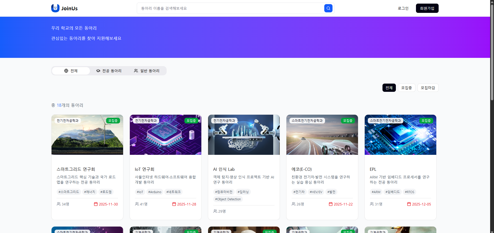

- 동아리 목록 조회 & 카드 UI
- 검색 및 모집 상태/카테고리 필터 기능
- 하트 버튼을 통한 관심 동아리 저장
- 모집 마감 임박 시 시각적 표시

---

## 📍 동아리 상세 페이지 – 정보 확인 & 지원 유도
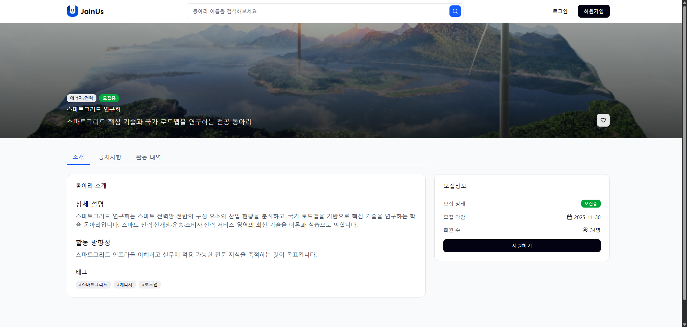

- 동아리 소개 / 활동 사진 / 모집 안내 확인
- 공지사항 및 활동 정보 제공
- "지원하기" 버튼을 통한 제출 페이지 이동
- 사용자 행동 흐름을 자연스럽게 유도

---

## 📍 지원서 작성 페이지 – 온라인 지원 프로세스
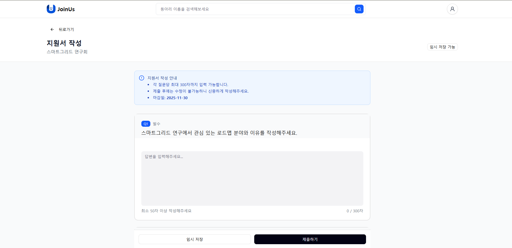

- 동아리별 맞춤 질문을 반영한 지원 폼
- 유효성 검사(입력값 미달/초과 방지)
- 저장 및 제출 기능 제공 → 서버에 데이터 전송

---

## 📍 알림 페이지 – 합격 안내 & 진행 상황 전달
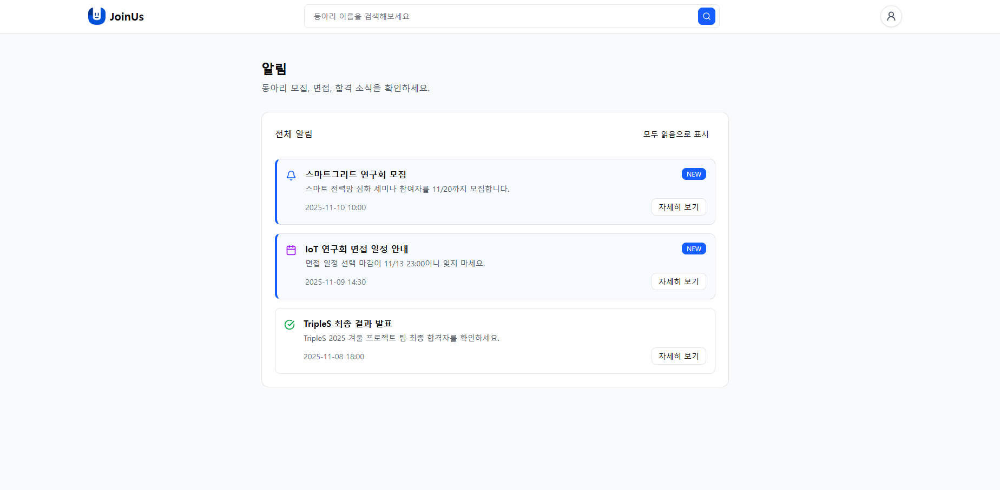

- 서류 / 면접 / 최종 결과별 알림 표시
- 클릭 시 관련 화면으로 이동 가능
- 지원자 경험을 위한 피드백 제공

---

## 📍 면접 일정 선택 페이지 – 시간 슬롯 예약
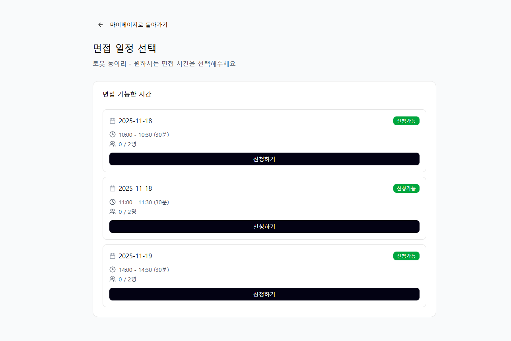

- 날짜·시간대·정원을 기반으로 면접 슬롯 선택
- 정원 초과 시 자동 비활성화 처리
- 면접 일정 변경 가능(리액션 높은 UX 설계)

---

## 📍 마이페이지 – 지원자 관리 홈
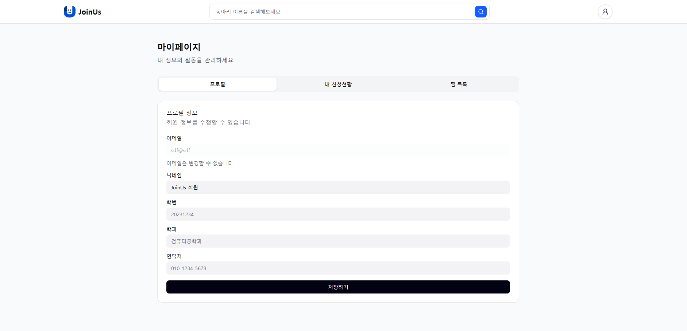

- 학번/학과/연락처/닉네임 등 기본 정보 수정
- 이메일은 보안상 수정 불가 처리
- 사용자가 직접 자신의 정보를 최신 상태로 유지하도록 지원

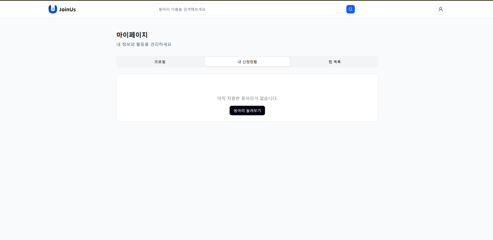

- 지원한 동아리의 서류합격 / 불합격 상태 조회
- 서류 합격 시 면접 일정 선택 단계로 자연스럽게 이동
- **지원 흐름에 따른 행동 유도 UX** 적용

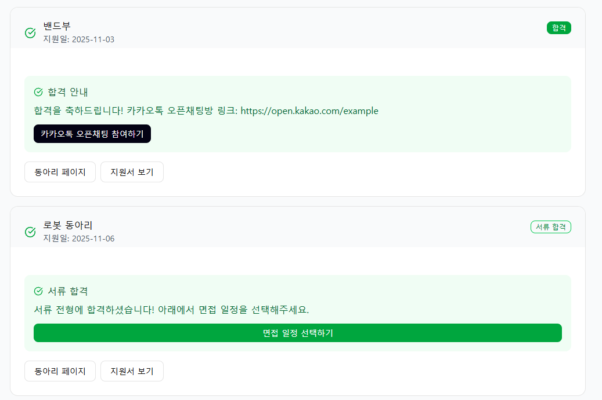

- 최종 합격/불합격 결과 표시
- 최종 합격 시 **오픈채팅방 입장 버튼** 제공
- 합격자와 동아리 간의 빠른 연결을 지원

---

## 📍 운영자 – 신청자 관리 화면
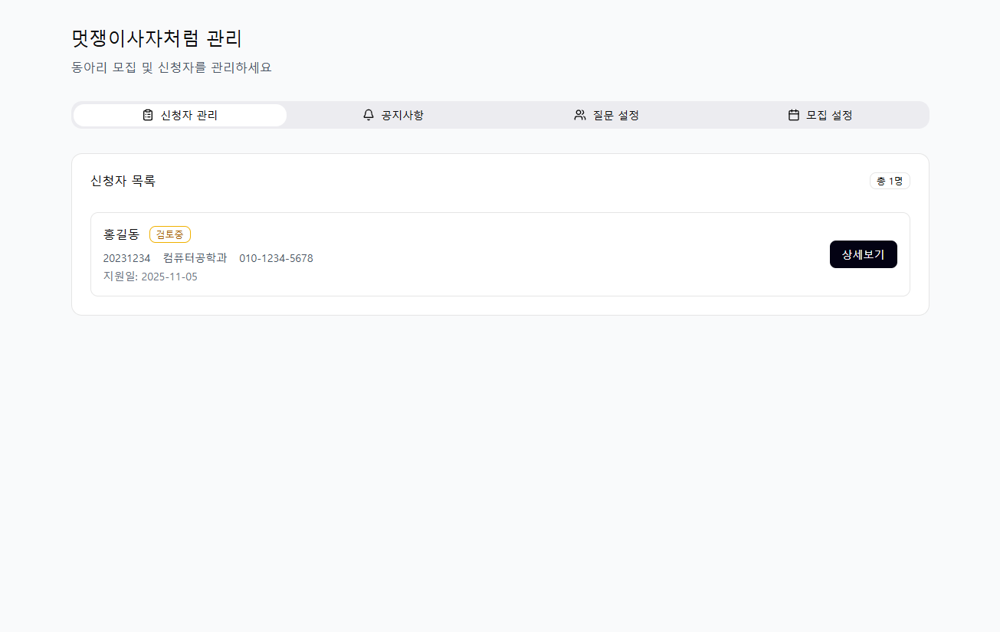

- 지원자 목록/개인 지원서 확인
- 서류 합격/불합격 처리 기능
- 동아리 운영자가 필요로 하는 정보만 제공하여 효율적 관리

---

## 📍 운영자 – 면접 일정 관리 화면
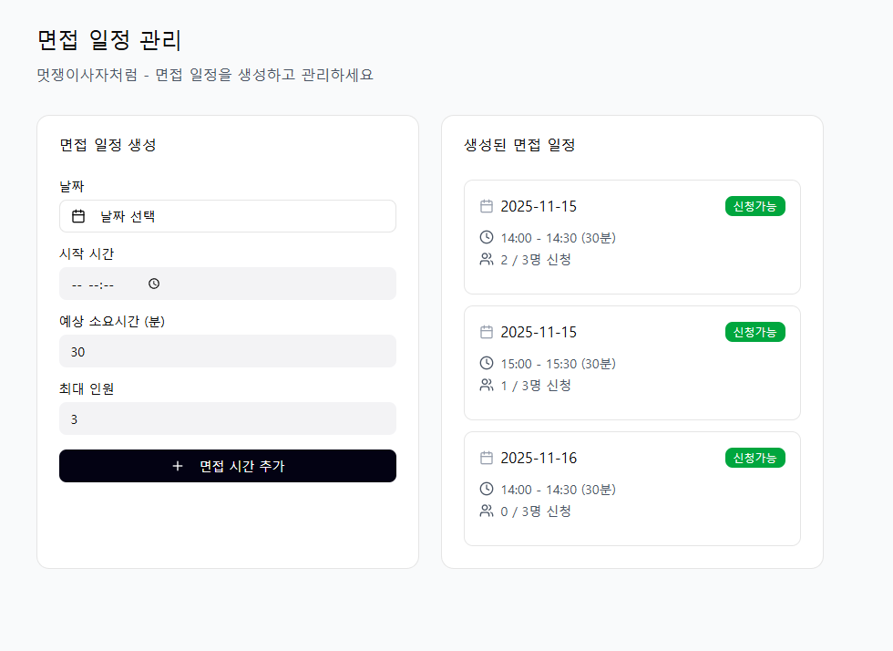

- 면접 일정 생성(날짜/시간/정원)
- 현재 신청 인원 시각화
- 정원 초과 시 자동 신청 제한

---

## 📍 운영자 – 질문 설정 화면
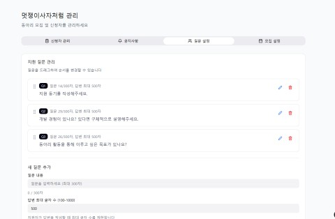

- 지원서 질문 CRUD 기능 제공
- 동아리별 평가 기준을 직접 반영 가능
- 지원서 구조의 유연성과 확장성 보장

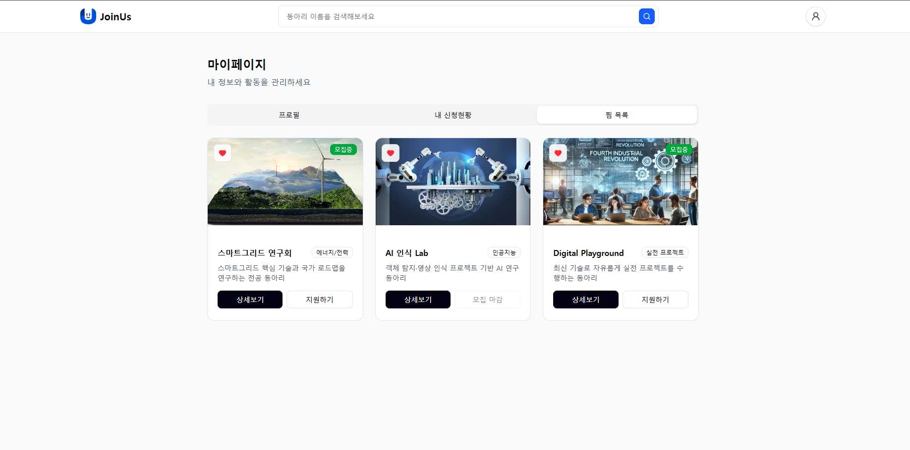

- 관심 동아리 저장 및 재방문 가능
- 모집 중/마감 여부 표시로 판단에 도움
- **탐색 → 지원 전환율을 높이는 핵심 기능**

---

## 📍 운영자 – 모집 설정 화면
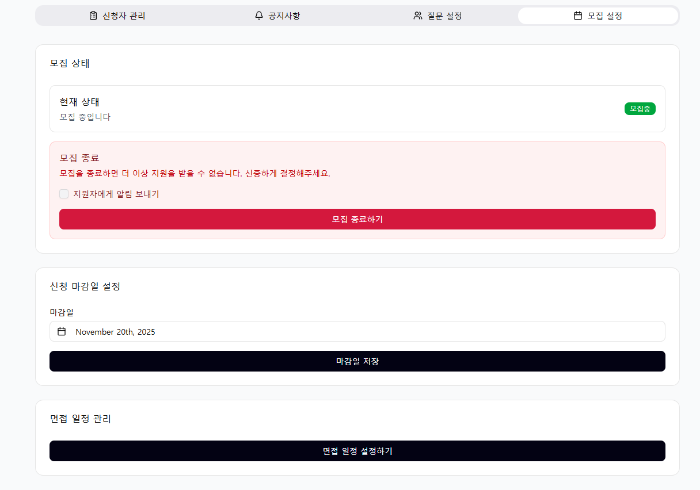

- 모집 상태 변경 (모집 중/마감)
- 모집 마감일 설정 → 자동 비활성 시스템
- 실 운영 기반 오류 예방 UX 적용

---

## 📍 운영자 – 공지사항 관리 화면
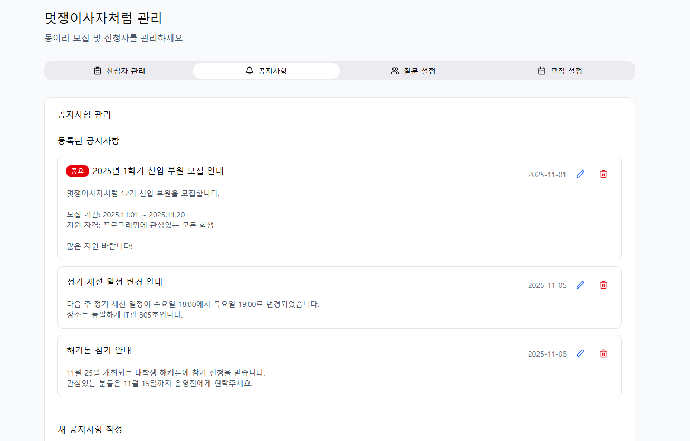

- 공지 등록/수정/삭제 기능
- 중요 공지는 강조 표시
- 사용자 커뮤니케이션 수단을 플랫폼 안으로 통합
